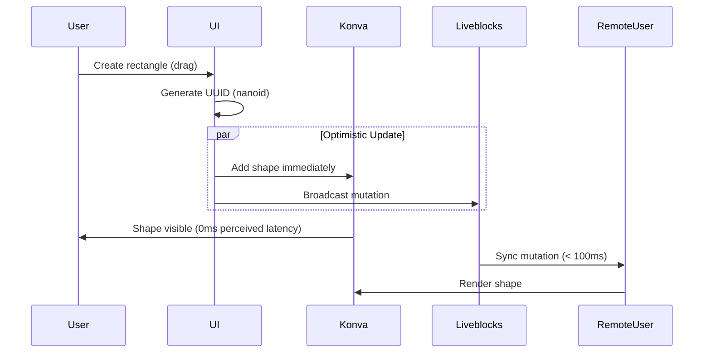
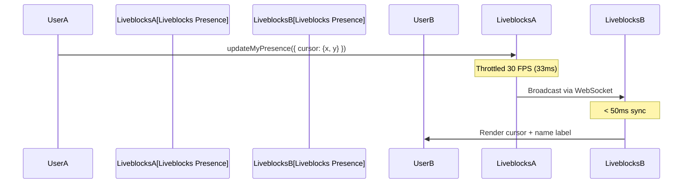
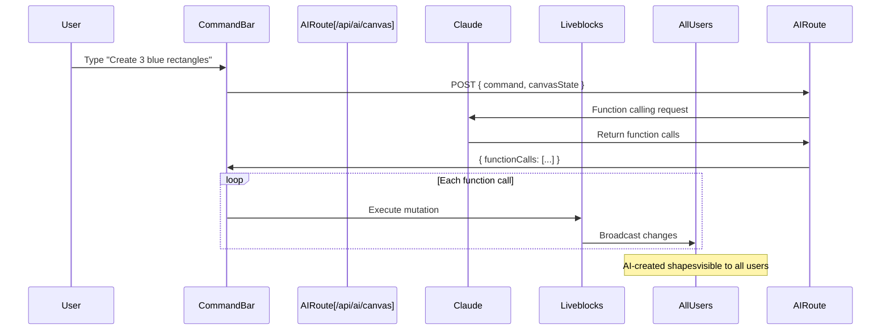

markdown# System Architecture Document
# CollabCanvas - Real-Time Collaborative Canvas with AI Agent

**Version:** 1.0  
**Date:** October 19, 2025  
**Status:** Approved for Development  
**Method:** BMAD (Breakthrough Method for Agile AI-Driven Development)

---

## Document Control

| Role | Name | Date | Signature |
|------|------|------|-----------|
| Architect | Claude (BMAD) | Oct 19, 2025 | ✅ Approved |
| Product Owner | Claude (BMAD) | Oct 19, 2025 | ✅ Approved |
| Technical Lead | Human Operator | Oct 19, 2025 | ⏳ Pending |

---

## Table of Contents

1. [Executive Summary](#1-executive-summary)
2. [System Architecture Overview](#2-system-architecture-overview)
3. [Component Architecture](#3-component-architecture)
4. [Data Architecture](#4-data-architecture)
5. [Architecture Decision Records (ADRs)](#5-architecture-decision-records)
6. [Technology Stack](#6-technology-stack)
7. [Development Standards](#7-development-standards)
8. [Project Structure](#8-project-structure)
9. [Performance Architecture](#9-performance-architecture)
10. [Security Architecture](#10-security-architecture)

---

## 1. Executive Summary

### 1.1 Architecture Philosophy

CollabCanvas follows a **modern, serverless, real-time-first architecture** optimized for:
- **Performance:** 60 FPS canvas rendering, < 100ms sync latency
- **Simplicity:** Minimal moving parts, maximum code reuse
- **Scalability:** Serverless infrastructure, horizontal scaling
- **Developer Experience:** Type-safe, well-documented, patterns from proven repos

### 1.2 Key Architectural Decisions

1. **Next.js 15 App Router** - Modern React with RSC (React Server Components)
2. **Liveblocks Lson Storage** - Real-time sync without Y.js complexity
3. **Konva.js for Canvas** - Mature, performant HTML5 canvas library
4. **Claude Haiku 3.5** - Cost-effective AI with excellent function calling
5. **Firebase Anonymous Auth** - Frictionless user identification
6. **Vercel Edge Deployment** - Global CDN, instant deploys

### 1.3 Reference Architecture

**Primary reference:** [andepants/figma-clone](https://github.com/andepants/figma-clone)
- Proven Liveblocks + Konva integration
- Production-tested patterns
- 80% code reuse opportunity
- Saves 3-5 hours development time

---

## 2. System Architecture Overview

### 2.1 High-Level Architecture Diagram
```mermaid
graph TB
    subgraph "Client Browser"
        UI[React UI Components]
        Canvas[Konva Canvas Layer]
        LiveblocksClient[Liveblocks Client SDK]
        FirebaseClient[Firebase Auth SDK]
    end

    subgraph "Next.js App (Vercel)"
        AppRouter[App Router Pages]
        APIRoutes[API Routes]
        AIRoute[/api/ai/canvas]
    end

    subgraph "External Services"
        Liveblocks[Liveblocks CloudReal-time Sync]
        Firebase[Firebase AuthAnonymous Users]
        Claude[Anthropic ClaudeHaiku 3.5 API]
    end

    UI --> Canvas
    UI --> LiveblocksClient
    UI --> FirebaseClient
    UI --> APIRoutes

    Canvas --> LiveblocksClient
    LiveblocksClient |WebSocket| Liveblocks
    FirebaseClient |HTTPS| Firebase
    
    APIRoutes --> AIRoute
    AIRoute -->|Function Calling| Claude
    AIRoute --> LiveblocksClient

    style Canvas fill:#4F46E5,color:#fff
    style Liveblocks fill:#10B981,color:#fff
    style Claude fill:#EC4899,color:#fff
```

### 2.2 Data Flow Architecture

#### 2.2.1 Object Creation Flow (Optimistic UI)


#### 2.2.2 Cursor Sync Flow (Presence)


#### 2.2.3 AI Command Flow


---

## 3. Component Architecture

### 3.1 Component Hierarchy
```
app/
├── layout.tsx (Root layout, providers)
├── page.tsx (Landing/redirect)
└── canvas/
    └── [roomId]/
        └── page.tsx (Canvas page, Liveblocks room)

components/
├── Canvas.tsx (Main Konva canvas, 'use client')
├── Toolbar.tsx (Tool selection)
├── CommandBar.tsx (AI input, '/' to activate)
├── PresenceBadge.tsx (Active users count)
├── ShareButton.tsx (Copy URL)
├── Cursor.tsx (Remote cursor rendering)
└── shapes/
    ├── Rectangle.tsx (Konva Rect)
    ├── Circle.tsx (Konva Circle)
    └── Text.tsx (Konva Text)

lib/
├── liveblocks.ts (Client setup, room config)
├── firebase.ts (Auth setup)
├── ai.ts (Claude API wrapper)
└── utils.ts (clampPosition, generateRoomId, etc.)

hooks/
├── useCanvas.ts (Canvas state, viewport)
├── useTools.ts (Active tool, shortcuts)
├── useSelection.ts (Selected objects)
└── useAI.ts (Command execution)

types/
├── canvas.ts (CanvasObject, Tool, etc.)
├── liveblocks.ts (Presence, Storage types)
└── ai.ts (FunctionCall, AICommand)
```

### 3.2 Key Components (Detailed)

#### 3.2.1 Canvas.tsx (Core Component)

**Responsibility:** Render Konva canvas, manage viewport, sync with Liveblocks

**Pattern from figma-clone repo:**
```typescript
'use client';

import { Stage, Layer } from 'react-konva';
import { useStorage, useMutation } from '@liveblocks/react';

export function Canvas() {
  const objects = useStorage((root) => root.objects); // LiveMap
  const [viewport, setViewport] = useState({ x: 0, y: 0, zoom: 1 });
  
  // Stage-level transforms for pan/zoom (GPU-accelerated)
  const stageRef = useRef(null);
  
  // Selective updates (no full re-render)
  const shapeRefs = useRef<Map>(new Map());
  
  // Pan handler (Space + drag)
  const handlePan = useCallback((e: KonvaEventObject) => {
    // Pattern from figma-clone: update stage position
    const stage = e.target.getStage();
    setViewport({ x: stage.x(), y: stage.y(), zoom: stage.scaleX() });
  }, []);
  
  // Zoom handler (wheel, zoom toward cursor)
  const handleZoom = useCallback((e: KonvaEventObject) => {
    e.evt.preventDefault();
    const stage = stageRef.current;
    const pointer = stage.getPointerPosition();
    
    // Pattern from figma-clone: zoom toward cursor
    const oldScale = stage.scaleX();
    const newScale = Math.max(0.25, Math.min(4, oldScale * (1 + e.evt.deltaY * -0.001)));
    
    const mousePointTo = {
      x: (pointer.x - stage.x()) / oldScale,
      y: (pointer.y - stage.y()) / oldScale,
    };
    
    stage.scale({ x: newScale, y: newScale });
    stage.position({
      x: pointer.x - mousePointTo.x * newScale,
      y: pointer.y - mousePointTo.y * newScale,
    });
    
    setViewport({ x: stage.x(), y: stage.y(), zoom: newScale });
  }, []);
  
  return (
    <Stage
      ref={stageRef}
      width={window.innerWidth}
      height={window.innerHeight}
      draggable // Space + drag for pan
      onWheel={handleZoom}
      x={viewport.x}
      y={viewport.y}
      scaleX={viewport.zoom}
      scaleY={viewport.zoom}
    >
      
        {objects?.map((obj) => (
          
        ))}
         {/* Remote cursors */}
      
    
  );
}
```

**Key patterns:**
- ✅ Single Konva layer (performance)
- ✅ Stage-level transforms (smooth pan/zoom)
- ✅ Selective updates via refs (no re-render all shapes)
- ✅ Direct copy from figma-clone repo

---

#### 3.2.2 Liveblocks Integration

**Pattern from figma-clone repo:**

**`lib/liveblocks.ts`:**
```typescript
import { createClient } from '@liveblocks/client';
import { createRoomContext } from '@liveblocks/react';

const client = createClient({
  publicApiKey: process.env.NEXT_PUBLIC_LIVEBLOCKS_PUBLIC_KEY!,
  throttle: 33, // 30 FPS (matches our spec)
});

// Storage type (from PRD FR-012)
type Storage = {
  objects: LiveMap>;
};

type Presence = {
  cursor: { x: number; y: number } | null;
  userName: string;
  userColor: string;
};

export const {
  RoomProvider,
  useStorage,
  useMutation,
  useOthers,
  useUpdateMyPresence,
} = createRoomContext(client);
```

**Room setup in `app/canvas/[roomId]/page.tsx`:**
```typescript
'use client';

import { RoomProvider } from '@/lib/liveblocks';
import { LiveMap, LiveObject } from '@liveblocks/client';

export default function CanvasPage({ params }: { params: { roomId: string } }) {
  return (
    <RoomProvider
      id={params.roomId}
      initialPresence={{
        cursor: null,
        userName: '', // Set after Firebase auth
        userColor: '',
      }}
      initialStorage={{
        objects: new LiveMap(),
      }}
    >
      
    
  );
}
```

**Mutation pattern (from figma-clone):**
```typescript
const createObject = useMutation(
  ({ storage }, obj: CanvasObject) => {
    storage.get('objects').set(obj.id, new LiveObject(obj));
  },
  []
);

const updateObject = useMutation(
  ({ storage }, id: string, updates: Partial) => {
    const obj = storage.get('objects').get(id);
    if (obj) {
      Object.entries(updates).forEach(([key, value]) => {
        obj.set(key as keyof CanvasObject, value);
      });
    }
  },
  []
);

const deleteObject = useMutation(
  ({ storage }, id: string) => {
    storage.get('objects').delete(id);
  },
  []
);
```

---

#### 3.2.3 AI Integration (`/api/ai/canvas/route.ts`)

**Server-side API route:**
```typescript
import Anthropic from '@anthropic-ai/sdk';
import { NextRequest, NextResponse } from 'next/server';

const anthropic = new Anthropic({
  apiKey: process.env.ANTHROPIC_API_KEY!,
});

// Function schemas (from PRD FR-019, FR-020)
const tools = [
  {
    name: 'createShape',
    description: 'Create one or more shapes on the canvas',
    input_schema: {
      type: 'object',
      properties: {
        shapeType: {
          type: 'string',
          enum: ['rect', 'circle', 'text'],
        },
        count: { type: 'number', minimum: 1, maximum: 10 },
        fill: { type: 'string' },
        text: { type: 'string' },
      },
      required: ['shapeType', 'count', 'fill'],
    },
  },
  {
    name: 'arrangeGrid',
    description: 'Arrange objects in a grid',
    input_schema: {
      type: 'object',
      properties: {
        objectIds: { type: 'array', items: { type: 'string' } },
        rows: { type: 'number', minimum: 1 },
        cols: { type: 'number', minimum: 1 },
        spacing: { type: 'number', default: 50 },
      },
      required: ['objectIds', 'rows', 'cols'],
    },
  },
];

export async function POST(req: NextRequest) {
  try {
    const { command, canvasState } = await req.json();
    
    // Call Claude with function calling
    const message = await anthropic.messages.create({
      model: 'claude-3-5-haiku-20241022',
      max_tokens: 1024,
      tools,
      messages: [
        {
          role: 'user',
          content: `Canvas state: ${JSON.stringify(canvasState)}\n\nUser command: "${command}"`,
        },
      ],
    });
    
    // Extract function calls
    const functionCalls = message.content
      .filter((block) => block.type === 'tool_use')
      .map((block) => ({
        name: block.name,
        args: block.input,
      }));
    
    return NextResponse.json({ functionCalls });
  } catch (error) {
    console.error('AI API error:', error);
    return NextResponse.json(
      { error: 'AI unavailable' },
      { status: 500 }
    );
  }
}
```

---

## 4. Data Architecture

### 4.1 Liveblocks Storage Schema

**From PRD FR-012:**
```typescript
type CanvasObject = {
  id: string;              // nanoid() - e.g., "vX7kR2pQ"
  type: 'rect' | 'circle' | 'text';
  x: number;               // Canvas position (0-20000)
  y: number;
  width: number;
  height: number;
  fill: string;            // Hex color: "#4F46E5"
  zIndex: number;          // Timestamp: Date.now()
  text?: string;           // For text objects only
  fontSize?: number;       // For text (16px default)
};

// Liveblocks storage root
type Storage = {
  objects: LiveMap>;
};
```

**Storage operations:**
```typescript
// Create (optimistic)
import { nanoid } from 'nanoid';

const id = nanoid();
const newObject: CanvasObject = {
  id,
  type: 'rect',
  x: 100,
  y: 100,
  width: 160,
  height: 100,
  fill: '#4F46E5',
  zIndex: Date.now(),
};

createObject(newObject); // useMutation hook

// Read
const objects = useStorage((root) => root.objects);
const objectsArray = Array.from(objects?.entries() || []);

// Update (throttled for drag)
const throttledUpdate = useMemo(
  () => throttle((id: string, x: number, y: number) => {
    updateObject(id, { x, y });
  }, 33), // 30 FPS
  []
);

// Delete
deleteObject(objectId);
```

### 4.2 Presence State Schema

**From PRD FR-014, FR-015:**
```typescript
type Presence = {
  cursor: { x: number; y: number } | null;
  userName: string;       // "User-Kx7n"
  userColor: string;      // "#4F46E5"
};

// Update presence (throttled)
const updateMyPresence = useUpdateMyPresence();

const throttledCursorUpdate = useMemo(
  () => throttle((x: number, y: number) => {
    updateMyPresence({ cursor: { x, y } });
  }, 33), // 30 FPS
  []
);

// Read others' presence
const others = useOthers();
const remoteCursors = others.map((user) => ({
  cursor: user.presence.cursor,
  userName: user.presence.userName,
  userColor: user.presence.userColor,
}));
```

### 4.3 Firebase Auth Data

**User structure:**
```typescript
// Firebase anonymous auth
const auth = getAuth();
const userCredential = await signInAnonymously(auth);

// Generate user data
const userId = userCredential.user.uid; // "Kx7n2Pq8WtR3..."
const userName = `User-${userId.slice(-4)}`; // "User-tR3..."
const userColor = USER_COLORS[Math.floor(Math.random() * 10)];

// Set in Liveblocks presence
updateMyPresence({ userName, userColor });
```

---

## 5. Architecture Decision Records (ADRs)

### ADR-0001: Real-Time Sync with Liveblocks

**Date:** 2025-10-19  
**Status:** Accepted  
**Decision Makers:** Architect, Product Owner

#### Context

Need real-time synchronization for collaborative canvas. Options:
1. Liveblocks (managed service)
2. Socket.io (custom server)
3. Supabase Realtime
4. Firebase Realtime Database

#### Decision

**Use Liveblocks with Lson storage** (NOT Y.js)

#### Rationale

**Why Liveblocks:**
- ✅ Purpose-built for collaborative apps
- ✅ Proven in figma-clone repo (andepants)
- ✅ Built-in presence, storage, conflict resolution
- ✅ WebSocket with auto-reconnect
- ✅ Free tier sufficient for MVP (100 MAU)
- ✅ < 100ms sync latency proven in competitive testing

**Why Lson over Y.js:**
- ✅ Simpler API (LiveMap, LiveObject)
- ✅ Direct object mutations (obj.set('x', newX))
- ✅ No CRDT complexity needed for our use case
- ✅ figma-clone repo uses Lson successfully
- ✅ Last Write Wins acceptable (per PRD)

**Why NOT Socket.io:**
- ❌ Requires custom server (adds complexity)
- ❌ No built-in storage/persistence
- ❌ Must implement conflict resolution manually
- ❌ Costs 4-6 hours extra development time

**Why NOT Supabase/Firebase:**
- ❌ Not optimized for high-frequency updates (cursors)
- ❌ Higher latency (HTTP polling vs WebSocket)
- ❌ More complex state management

#### Implementation

**Room structure:** `/canvas/[roomId]`
**Room IDs:** Random words (adjective-noun-number)
**Storage:** LiveMap of LiveObjects
**Throttling:** 30 FPS for object updates, 30 FPS for cursors
**Conflict resolution:** Last Write Wins (Liveblocks default)

**Code pattern (from figma-clone):**
- Optimistic UI with pre-generated UUIDs
- Selective Konva updates (shapeRefs map)
- Try/catch around all storage operations

#### Consequences

**Positive:**
- ✅ 3-5 hours saved by copying figma-clone patterns
- ✅ Battle-tested, reliable sync
- ✅ Meets < 100ms sync target
- ✅ Auto-reconnect handled by Liveblocks

**Negative:**
- ⚠️ Vendor lock-in (Liveblocks)
- ⚠️ Free tier limit (100 MAU)
- ⚠️ Must trust third-party service

**Mitigation:**
- Free tier sufficient for MVP/demo
- Can migrate to self-hosted later if needed
- Liveblocks has 99.9% uptime SLA

---

### ADR-0002: Canvas Rendering with Konva

**Date:** 2025-10-19  
**Status:** Accepted

#### Context

Need high-performance canvas rendering for 500+ objects at 60 FPS. Options:
1. Konva.js (Canvas API wrapper)
2. Raw HTML5 Canvas API
3. SVG (React components)
4. Three.js / PixiJS (WebGL)

#### Decision

**Use Konva.js with single-layer architecture**

#### Rationale

**Why Konva:**
- ✅ Proven in figma-clone repo (60 FPS with 500 objects)
- ✅ React bindings (react-konva)
- ✅ Event system built-in (click, drag)
- ✅ Transform support (rotate, scale, skew)
- ✅ Mature library (9+ years, active maintenance)
- ✅ Stage-level transforms for smooth pan/zoom

**Why NOT Raw Canvas:**
- ❌ Must implement event system manually
- ❌ Must implement hit detection manually
- ❌ Costs 6-10 hours extra development time

**Why NOT SVG:**
- ❌ DOM-based (slower with 500+ objects)
- ❌ No 60 FPS at scale
- ❌ Pan/zoom more complex

**Why NOT WebGL (Three.js/PixiJS):**
- ❌ Over-engineered for 2D canvas
- ❌ Steeper learning curve
- ❌ Harder to implement text editing

#### Implementation

**Architecture:**
- Single Konva Layer (no multiple layers for MVP)
- Stage-level transforms (GPU-accelerated pan/zoom)
- Selective updates (shapeRefs map, no full re-render)
- Client-side only ('use client' directive)

**Code pattern (from figma-clone):**
```typescript
// Stage transform for pan/zoom
stage.x(cameraX);
stage.y(cameraY);
stage.scale({ x: zoom, y: zoom });

// Selective updates
const shapeRef = shapeRefs.get(objectId);
shapeRef.x(newX);
shapeRef.y(newY);
layer.batchDraw(); // Single re-render
```

**Performance optimization:**
- RequestAnimationFrame for smooth updates
- Throttle drag updates (30 FPS)
- Memory cleanup (shape.destroy() on delete)

#### Consequences

**Positive:**
- ✅ 60 FPS proven achievable
- ✅ 2-3 hours saved by copying figma-clone patterns
- ✅ Event system included
- ✅ Works great with Liveblocks sync

**Negative:**
- ⚠️ Client-side only (no SSR)
- ⚠️ Larger bundle size (+150KB)

**Mitigation:**
- 'use client' directive isolates Konva
- 150KB acceptable for canvas app
- Next.js code splitting helps

---

### ADR-0003: AI Function Calling with Claude

**Date:** 2025-10-19  
**Status:** Accepted

#### Context

Need AI agent for natural language canvas manipulation. Options:
1. Anthropic Claude (Haiku, Sonnet)
2. OpenAI GPT-4o
3. Open-source LLM (Llama, Mistral)

#### Decision

**Use Anthropic Claude Haiku 3.5 with function calling**

#### Rationale

**Why Claude Haiku:**
- ✅ Cheapest option ($1/1M input tokens vs $2.50/1M for GPT-4o)
- ✅ Fast responses (< 2s)
- ✅ Excellent function calling support
- ✅ 200k context window (more than enough)
- ✅ Cost: ~$0.0004 per command (negligible)

**Why NOT GPT-4o:**
- ❌ 2.5× more expensive
- ❌ Similar performance to Haiku for function calling
- ❌ No significant advantage for our use case

**Why NOT Open-source:**
- ❌ Requires self-hosting (adds complexity)
- ❌ Slower inference
- ❌ Function calling less reliable
- ❌ Not worth the cost savings ($5 budget vs $0 budget)

#### Implementation

**API Route:** `/api/ai/canvas` (Next.js API route)
**Functions:** createShape, arrangeGrid
**Context:** Up to 100 objects + viewport + selected IDs
**Error handling:** Validate all function calls, default bad values

**Code pattern:**
```typescript
const message = await anthropic.messages.create({
  model: 'claude-3-5-haiku-20241022',
  max_tokens: 1024,
  tools: [createShape, arrangeGrid],
  messages: [{ role: 'user', content: `${canvasState}\n\n${command}` }],
});

const functionCalls = message.content
  .filter((block) => block.type === 'tool_use')
  .map((block) => ({ name: block.name, args: block.input }));
```

#### Consequences

**Positive:**
- ✅ Lowest cost option
- ✅ Fast enough (< 2s)
- ✅ Reliable function calling
- ✅ $5 budget = 13,000+ commands

**Negative:**
- ⚠️ Vendor lock-in (Anthropic)
- ⚠️ API key required (security concern)

**Mitigation:**
- API key server-side only (API routes)
- Can switch to GPT-4o later if needed
- Function schemas portable

---

### ADR-0004: Firebase Anonymous Auth

**Date:** 2025-10-19  
**Status:** Accepted

#### Context

Need frictionless user identification. Options:
1. Firebase Anonymous Auth
2. Clerk
3. Auth0
4. Custom JWT system

#### Decision

**Use Firebase Anonymous Auth**

#### Rationale

**Why Firebase:**
- ✅ Proven in figma-clone repo
- ✅ Zero-friction (no signup)
- ✅ Free tier unlimited
- ✅ Reliable UID generation
- ✅ Simple SDK

**Why NOT Clerk/Auth0:**
- ❌ Overkill for anonymous auth
- ❌ Requires signup flow (friction)
- ❌ More expensive

**Why NOT Custom JWT:**
- ❌ Must implement token generation
- ❌ Must implement refresh logic
- ❌ Costs 2-3 hours development time

#### Implementation
```typescript
import { getAuth, signInAnonymously } from 'firebase/auth';

const auth = getAuth();
const user = await signInAnonymously(auth);

const userName = `User-${user.uid.slice(-4)}`;
const userColor = USER_COLORS[Math.random() * 10 | 0];

updateMyPresence({ userName, userColor });
```

#### Consequences

**Positive:**
- ✅ 30 minutes implementation time
- ✅ Copy pattern from figma-clone
- ✅ Zero user friction

**Negative:**
- ⚠️ Users can't "log back in" (anonymous)
- ⚠️ New UID every clear cookies

**Mitigation:**
- Acceptable for MVP/demo
- Can add persistent auth later

---

## 6. Technology Stack

### 6.1 Core Framework

**Next.js 15.0.0**
- App Router (React Server Components)
- API Routes (serverless functions)
- Automatic code splitting
- Fast Refresh development
- Vercel deployment optimized

**React 19.0.0**
- Latest stable release
- Server Components support
- Improved performance
- Better error boundaries

**TypeScript 5.6.3**
- Strict mode enabled
- No `any` types allowed
- Path aliases configured (`@/*`)
- Type-safe imports

### 6.2 Real-Time & Canvas

**Liveblocks 2.11.0**
- `@liveblocks/client` - Core client
- `@liveblocks/react` - React bindings
- Lson storage (LiveMap, LiveObject)
- Presence API for cursors
- WebSocket transport

**Konva 9.3.2 + react-konva 18.2.9**
- HTML5 Canvas rendering
- Event system (drag, click, wheel)
- Transform support
- Stage/Layer architecture
- GPU-accelerated

### 6.3 Authentication & AI

**Firebase 11.0.1**
- `firebase/auth` - Anonymous authentication
- Client-side SDK only
- Free tier (unlimited anonymous)

**Anthropic Claude SDK**
- `@anthropic-ai/sdk` - Official TypeScript SDK
- Claude Haiku 3.5 model
- Function calling support
- Streaming not used (simple responses)

### 6.4 Utilities

**nanoid**
- UUID generation (shorter than uuid)
- Cryptographically secure
- URL-safe characters

**lodash**
- `throttle` for cursor/object updates
- Utility functions as needed

### 6.5 Styling

**Tailwind CSS 3.4.14**
- Utility-first CSS
- Custom brand colors configured
- JIT compiler
- PostCSS + Autoprefixer

### 6.6 Development Tools

**ESLint 9.13.0**
- Next.js config
- TypeScript rules
- Strict: no-console (warn), no `any` (error)

**TypeScript**
- Strict mode
- No emit (Next.js handles compilation)
- Path aliases
- Incremental compilation

---

## 7. Development Standards

### 7.1 TypeScript Standards

#### 7.1.1 Strict Rules
```typescript
// ✅ GOODRetryVContinue// Explicit types
function createObject(x: number, y: number): CanvasObject {
return {
id: nanoid(),
type: 'rect',
x,
y,
width: 160,
height: 100,
fill: '#4F46E5',
zIndex: Date.now(),
};
}
// Type imports
import type { CanvasObject } from '@/types/canvas';
// Union types for variants
type ShapeType = 'rect' | 'circle' | 'text';
// ❌ BAD - NEVER USE
// No 'any' types
function badFunction(data: any) { } // ERROR
// No implicit any
function badFunction2(data) { } // ERROR
// No non-null assertions without comment
const obj = objects.get(id)!; // ERROR - use if check instead

#### 7.1.2 Type Organization
```typescript
// types/canvas.ts
export type CanvasObject = {
  id: string;
  type: ShapeType;
  x: number;
  y: number;
  width: number;
  height: number;
  fill: string;
  zIndex: number;
  text?: string;
  fontSize?: number;
};

export type ShapeType = 'rect' | 'circle' | 'text';

export type Tool = 'select' | 'rect' | 'circle' | 'text';

export type Viewport = {
  x: number;
  y: number;
  zoom: number;
};
```

### 7.2 React Patterns

#### 7.2.1 Server vs Client Components
```typescript
// ✅ Server Component (default)
// app/page.tsx
export default function HomePage() {
  return <div>Landing page</div>;
}

// ✅ Client Component (explicit directive)
// components/Canvas.tsx
'use client';

import { Stage, Layer } from 'react-konva';

export function Canvas() {
  // Uses browser APIs, state, effects
  return <Stage>...</Stage>;
}
```

**Rules:**
- Server Components by default
- Add 'use client' only when needed:
  - Browser APIs (window, document)
  - React hooks (useState, useEffect)
  - Event handlers (onClick, onDrag)
  - Third-party libraries that use hooks (Konva, Liveblocks)

#### 7.2.2 Hook Patterns
```typescript
// ✅ GOOD - Custom hooks with clear names
export function useCanvas() {
  const [viewport, setViewport] = useState<Viewport>({
    x: 0,
    y: 0,
    zoom: 1,
  });
  
  const pan = useCallback((dx: number, dy: number) => {
    setViewport((prev) => ({
      ...prev,
      x: prev.x + dx,
      y: prev.y + dy,
    }));
  }, []);
  
  return { viewport, pan };
}

// ✅ GOOD - Memoized expensive computations
const sortedObjects = useMemo(
  () => objects.sort((a, b) => a.zIndex - b.zIndex),
  [objects]
);

// ✅ GOOD - Throttled callbacks
const throttledUpdate = useMemo(
  () => throttle((id: string, x: number, y: number) => {
    updateObject(id, { x, y });
  }, 33),
  [updateObject]
);
```

#### 7.2.3 Component Structure
```typescript
// ✅ GOOD - Consistent component structure

'use client';

// 1. Imports (grouped: React, external, internal, types)
import { useCallback, useMemo, useRef } from 'react';
import { Stage, Layer } from 'react-konva';
import { useStorage, useMutation } from '@liveblocks/react';
import { Canvas } from '@/components/Canvas';
import type { CanvasObject } from '@/types/canvas';

// 2. Types/Interfaces (local to component)
interface CanvasProps {
  roomId: string;
}

// 3. Component
export function Canvas({ roomId }: CanvasProps) {
  // 3a. Hooks (state, context, custom hooks)
  const objects = useStorage((root) => root.objects);
  const [tool, setTool] = useState<Tool>('select');
  
  // 3b. Refs
  const stageRef = useRef<Konva.Stage>(null);
  
  // 3c. Callbacks (memoized)
  const handleZoom = useCallback((e: KonvaEventObject<WheelEvent>) => {
    // Implementation
  }, []);
  
  // 3d. Computed values (memoized)
  const sortedObjects = useMemo(
    () => Array.from(objects?.entries() || []),
    [objects]
  );
  
  // 3e. Effects (minimal, only when necessary)
  useEffect(() => {
    // Setup/cleanup
  }, []);
  
  // 3f. Render
  return (
    <Stage ref={stageRef} onWheel={handleZoom}>
      <Layer>
        {sortedObjects.map(([id, obj]) => (
          <ShapeRenderer key={id} object={obj} />
        ))}
      </Layer>
    </Stage>
  );
}
```

### 7.3 File Naming Conventions
```
✅ GOOD
components/Canvas.tsx          // PascalCase for components
lib/liveblocks.ts              // camelCase for utilities
hooks/useCanvas.ts             // camelCase with 'use' prefix
types/canvas.ts                // camelCase for type files
app/canvas/[roomId]/page.tsx   // Next.js conventions

❌ BAD
components/canvas.tsx          // Should be PascalCase
lib/Liveblocks.ts              // Should be camelCase
hooks/Canvas.ts                // Missing 'use' prefix
types/Canvas.ts                // Should be camelCase
```

### 7.4 Import Organization
```typescript
// ✅ GOOD - Organized imports

// 1. React
import { useState, useCallback, useMemo } from 'react';

// 2. Next.js
import { useRouter } from 'next/navigation';

// 3. External libraries (alphabetical)
import { nanoid } from 'nanoid';
import { Stage, Layer } from 'react-konva';
import { throttle } from 'lodash';

// 4. Liveblocks (grouped together)
import { useStorage, useMutation } from '@liveblocks/react';

// 5. Internal components
import { Canvas } from '@/components/Canvas';
import { Toolbar } from '@/components/Toolbar';

// 6. Internal utilities
import { clampPosition } from '@/lib/utils';

// 7. Types (always last, with 'type' keyword)
import type { CanvasObject } from '@/types/canvas';
import type { Tool } from '@/types/canvas';
```

### 7.5 Error Handling
```typescript
// ✅ GOOD - Try/catch around Liveblocks operations

const updateObject = useMutation(
  ({ storage }, id: string, updates: Partial<CanvasObject>) => {
    try {
      const obj = storage.get('objects').get(id);
      if (!obj) {
        console.warn(`Object ${id} not found`);
        return;
      }
      
      Object.entries(updates).forEach(([key, value]) => {
        obj.set(key as keyof CanvasObject, value);
      });
    } catch (error) {
      console.error('Failed to update object:', error);
      // Toast notification to user
      toast.error('Failed to update object');
    }
  },
  []
);

// ✅ GOOD - Validate AI responses

function validateFunctionCall(call: FunctionCall): boolean {
  const validFunctions = ['createShape', 'arrangeGrid'];
  
  if (!validFunctions.includes(call.name)) {
    console.warn('Unknown function:', call.name);
    return false;
  }
  
  if (call.name === 'createShape') {
    if (call.args.count > 10) {
      console.warn('Count exceeds max, capping to 10');
      call.args.count = 10;
    }
    
    if (!isValidColor(call.args.fill)) {
      console.warn('Invalid color, using default');
      call.args.fill = '#3B82F6';
    }
  }
  
  return true;
}
```

### 7.6 Performance Patterns
```typescript
// ✅ GOOD - Throttle high-frequency updates

import { throttle } from 'lodash';

const throttledCursorUpdate = useMemo(
  () => throttle((x: number, y: number) => {
    updateMyPresence({ cursor: { x, y } });
  }, 33), // 30 FPS
  [updateMyPresence]
);

// ✅ GOOD - Selective Konva updates (from figma-clone)

const shapeRefs = useRef<Map<string, Konva.Shape>>(new Map());

// On object change, update only that shape
useEffect(() => {
  objects?.forEach((obj, id) => {
    const shape = shapeRefs.current.get(id);
    if (shape) {
      shape.x(obj.x);
      shape.y(obj.y);
      shape.width(obj.width);
      shape.height(obj.height);
    }
  });
  
  layer.batchDraw(); // Single re-render
}, [objects]);

// ✅ GOOD - Memory cleanup

useEffect(() => {
  // Track current object IDs
  const currentIds = new Set(objects?.keys() || []);
  
  // Remove shapes for deleted objects
  shapeRefs.current.forEach((shape, id) => {
    if (!currentIds.has(id)) {
      shape.destroy();
      shapeRefs.current.delete(id);
    }
  });
}, [objects]);
```

---

## 8. Project Structure

### 8.1 Directory Layout
```
collab-canva-bmad/
├── .bmad-core/                    # BMAD method framework
│   ├── agents/                    # BMAD agents (SM, Dev, QA, etc.)
│   ├── tasks/                     # BMAD tasks
│   ├── templates/                 # BMAD templates
│   └── data/
│       └── technical-preferences.md
│
├── docs/                          # Planning documents
│   ├── research/
│   │   ├── market-analysis.md
│   │   ├── competitive-analysis.md
│   │   └── scope-validation.md
│   ├── prd.md                     # Product Requirements
│   ├── architecture.md            # This document
│   ├── scope-final.md
│   └── stories/                   # User story files
│       ├── story-01-canvas-setup.md
│       ├── story-02-rectangle-tool.md
│       └── ...
│
├── src/
│   ├── app/                       # Next.js App Router
│   │   ├── layout.tsx             # Root layout, providers
│   │   ├── page.tsx               # Landing page
│   │   ├── canvas/
│   │   │   └── [roomId]/
│   │   │       └── page.tsx       # Canvas page
│   │   └── api/
│   │       └── ai/
│   │           └── canvas/
│   │               └── route.ts   # AI API endpoint
│   │
│   ├── components/                # React components
│   │   ├── Canvas.tsx             # Main Konva canvas
│   │   ├── Toolbar.tsx            # Tool selection
│   │   ├── CommandBar.tsx         # AI command input
│   │   ├── PresenceBadge.tsx      # Active users count
│   │   ├── ShareButton.tsx        # Copy URL
│   │   ├── Cursor.tsx             # Remote cursor
│   │   └── shapes/
│   │       ├── Rectangle.tsx      # Konva Rect wrapper
│   │       ├── Circle.tsx         # Konva Circle wrapper
│   │       └── Text.tsx           # Konva Text wrapper
│   │
│   ├── hooks/                     # Custom React hooks
│   │   ├── useCanvas.ts           # Canvas state, viewport
│   │   ├── useTools.ts            # Active tool, shortcuts
│   │   ├── useSelection.ts        # Selected objects
│   │   └── useAI.ts               # AI command execution
│   │
│   ├── lib/                       # Utilities, configs
│   │   ├── liveblocks.ts          # Liveblocks client setup
│   │   ├── firebase.ts            # Firebase auth setup
│   │   ├── ai.ts                  # Claude API wrapper
│   │   └── utils.ts               # Utility functions
│   │
│   └── types/                     # TypeScript types
│       ├── canvas.ts              # Canvas types
│       ├── liveblocks.ts          # Liveblocks types
│       └── ai.ts                  # AI types
│
├── public/                        # Static assets
│   └── icons/                     # Tool icons, cursor icons
│
├── .env.local                     # Environment variables (gitignored)
├── .env.example                   # Example env file
├── .eslintrc.json                 # ESLint config
├── .gitignore                     # Git ignore rules
├── next.config.ts                 # Next.js config
├── package.json                   # Dependencies
├── postcss.config.mjs             # PostCSS config
├── tailwind.config.ts             # Tailwind config
├── tsconfig.json                  # TypeScript config
└── README.md                      # Project readme
```

### 8.2 Key Files (Detailed)

#### 8.2.1 Root Config Files

**`next.config.ts`:**
```typescript
import type { NextConfig } from 'next';

const nextConfig: NextConfig = {
  experimental: {
    typedRoutes: true, // Type-safe routing
  },
  images: {
    dangerouslyAllowSVG: true,
    remotePatterns: [
      {
        protocol: 'https',
        hostname: '**',
      },
    ],
  },
};

export default nextConfig;
```

**`tsconfig.json`:**
```json
{
  "compilerOptions": {
    "target": "ES2022",
    "lib": ["DOM", "DOM.Iterable", "ES2022"],
    "allowJs": false,
    "skipLibCheck": true,
    "strict": true,
    "forceConsistentCasingInFileNames": true,
    "noEmit": true,
    "esModuleInterop": true,
    "module": "ESNext",
    "moduleResolution": "Bundler",
    "resolveJsonModule": true,
    "isolatedModules": true,
    "jsx": "preserve",
    "incremental": true,
    "types": ["@types/node"],
    "paths": {
      "@/*": ["./src/*"]
    }
  },
  "include": ["next-env.d.ts", "**/*.ts", "**/*.tsx"],
  "exclude": ["node_modules"]
}
```

**`tailwind.config.ts`:**
```typescript
import type { Config } from 'tailwindcss';

const config: Config = {
  content: [
    './src/app/**/*.{ts,tsx}',
    './src/components/**/*.{ts,tsx}',
  ],
  theme: {
    extend: {
      colors: {
        brand: {
          DEFAULT: '#4C5FD5',
          dark: '#3C4CB0',
          light: '#E4E6FB',
        },
      },
    },
  },
  plugins: [],
};

export default config;
```

**`.eslintrc.json`:**
```json
{
  "root": true,
  "extends": ["next/core-web-vitals", "next/typescript"],
  "parserOptions": {
    "project": "./tsconfig.json"
  },
  "rules": {
    "no-console": ["warn", { "allow": ["warn", "error"] }],
    "@typescript-eslint/consistent-type-imports": "error",
    "@typescript-eslint/no-explicit-any": "error"
  }
}
```

#### 8.2.2 Key Utilities

**`lib/utils.ts`:**
```typescript
import { type ClassValue, clsx } from 'clsx';
import { twMerge } from 'tailwind-merge';

// Tailwind class merging
export function cn(...inputs: ClassValue[]) {
  return twMerge(clsx(inputs));
}

// Clamp position to canvas bounds (from figma-clone pattern)
export function clampPosition(
  x: number,
  y: number,
  width: number,
  height: number
): { x: number; y: number } {
  const CANVAS_SIZE = 20000;
  
  return {
    x: Math.max(0, Math.min(CANVAS_SIZE - width, x)),
    y: Math.max(0, Math.min(CANVAS_SIZE - height, y)),
  };
}

// Generate room ID (random words)
export function generateRoomId(): string {
  const adjectives = ['happy', 'clever', 'swift', 'bright', 'calm'];
  const nouns = ['turtle', 'panda', 'eagle', 'lion', 'wolf'];
  
  const adj = adjectives[Math.floor(Math.random() * adjectives.length)];
  const noun = nouns[Math.floor(Math.random() * nouns.length)];
  const num = Math.floor(Math.random() * 100);
  
  return `${adj}-${noun}-${num}`;
}

// Validate hex color
export function isValidColor(color: string): boolean {
  return /^#[0-9A-F]{6}$/i.test(color);
}

// User color palette
export const USER_COLORS = [
  '#4F46E5', // indigo
  '#EC4899', // pink
  '#10B981', // green
  '#F59E0B', // amber
  '#8B5CF6', // violet
  '#EF4444', // red
  '#06B6D4', // cyan
  '#84CC16', // lime
  '#F97316', // orange
  '#A855F7', // purple
];
```

---

## 9. Performance Architecture

### 9.1 Performance Targets (from PRD)

| Metric | Target | Measurement |
|--------|--------|-------------|
| Frame Rate | 60 FPS | Chrome DevTools Performance |
| Object Sync Latency | < 100ms | Network tab timestamps |
| Cursor Sync Latency | < 50ms | Network tab timestamps |
| AI Command Execution | < 2s | Stopwatch |
| Initial Load | < 2s | Lighthouse |
| Room Join | < 1s | Manual testing |
| 500 Objects Render | < 1s | Manual testing |

### 9.2 Performance Optimizations

#### 9.2.1 Canvas Rendering

**Single Layer Architecture:**
- One Konva Layer (not multiple)
- Reduces draw calls
- Simpler state management

**Stage-Level Transforms:**
```typescript
// GPU-accelerated pan/zoom
stage.x(cameraX);
stage.y(cameraY);
stage.scale({ x: zoom, y: zoom });

// No need to update individual shapes
```

**Selective Updates (from figma-clone):**
```typescript
// Don't re-render everything
const shapeRefs = useRef<Map<string, Konva.Shape>>(new Map());

// Update only changed shapes
objects?.forEach((obj, id) => {
  const shape = shapeRefs.current.get(id);
  if (shape) {
    shape.x(obj.x);
    shape.y(obj.y);
    // ... update only changed properties
  }
});

layer.batchDraw(); // Single draw call
```

**Memory Management:**
```typescript
// Cleanup deleted shapes
useEffect(() => {
  const currentIds = new Set(objects?.keys());
  
  shapeRefs.current.forEach((shape, id) => {
    if (!currentIds.has(id)) {
      shape.destroy(); // Free memory
      shapeRefs.current.delete(id);
    }
  });
}, [objects]);
```

#### 9.2.2 Network Optimization

**Throttling:**
```typescript
// Object updates: 30 FPS (33ms)
const throttledUpdate = useMemo(
  () => throttle((id, x, y) => {
    updateObject(id, { x, y });
  }, 33),
  []
);

// Cursor updates: 30 FPS (33ms)
const throttledCursor = useMemo(
  () => throttle((x, y) => {
    updateMyPresence({ cursor: { x, y } });
  }, 33),
  []
);
```

**Payload Optimization:**
- Limit AI canvas state to 100 objects
- Send only changed properties (not full object)
- Use nanoid (11 chars) instead of UUID (36 chars)

#### 9.2.3 Code Splitting

**Next.js Automatic:**
- Each route is automatically code-split
- Konva loaded only on `/canvas/[roomId]` page
- AI loaded only when command bar used

**Dynamic Imports (if needed):**
```typescript
// Load AI client only when needed
const AIClient = dynamic(() => import('@/lib/ai'), {
  loading: () => <p>Loading AI...</p>,
});
```

### 9.3 Performance Monitoring

**Development:**
```typescript
// Add performance markers
performance.mark('canvas-render-start');
// ... render canvas
performance.mark('canvas-render-end');
performance.measure('canvas-render', 'canvas-render-start', 'canvas-render-end');

// Log to console (dev only)
if (process.env.NODE_ENV === 'development') {
  console.log('Render time:', performance.getEntriesByName('canvas-render')[0].duration);
}
```

**Production:**
- Vercel Analytics (free tier)
- Lighthouse CI on deploy
- Manual testing with 500 objects

---

## 10. Security Architecture

### 10.1 API Key Protection

**Environment Variables:**
```bash
# .env.local (NEVER commit)
NEXT_PUBLIC_LIVEBLOCKS_PUBLIC_KEY=pk_dev_...  # Public (client-side OK)
LIVEBLOCKS_SECRET_KEY=sk_dev_...              # Secret (server-side only)
NEXT_PUBLIC_FIREBASE_API_KEY=...              # Public (client-side OK)
NEXT_PUBLIC_FIREBASE_AUTH_DOMAIN=...          # Public
NEXT_PUBLIC_FIREBASE_PROJECT_ID=...           # Public
ANTHROPIC_API_KEY=sk-ant-...                  # Secret (server-side only)
```

**Server-Side Only:**
```typescript
// ✅ GOOD - API route (server-side)
// app/api/ai/canvas/route.ts
const anthropic = new Anthropic({
  apiKey: process.env.ANTHROPIC_API_KEY, // Server-side, safe
});

// ❌ BAD - Client component
'use client';
const anthropic = new Anthropic({
  apiKey: process.env.ANTHROPIC_API_KEY, // Exposed to client!
});
```

### 10.2 Input Validation

**AI Commands:**
```typescript
// Validate all inputs
function validateAICommand(command: string): boolean {
  // Max length
  if (command.length > 500) {
    return false;
  }
  
  // No malicious patterns
  if (/<script|javascript:|onerror=/i.test(command)) {
    return false;
  }
  
  return true;
}

// Validate function calls
function validateFunctionCall(call: FunctionCall): boolean {
  // Whitelist functions
  if (!['createShape', 'arrangeGrid'].includes(call.name)) {
    return false;
  }
  
  // Cap values
  if (call.args.count > 10) {
    call.args.count = 10;
  }
  
  // Validate colors
  if (!isValidColor(call.args.fill)) {
    call.args.fill = '#3B82F6';
  }
  
  return true;
}
```

**Canvas Bounds:**
```typescript
// Always clamp positions
const { x, y } = clampPosition(
  newX,
  newY,
  object.width,
  object.height
);
```

### 10.3 Liveblocks Security

**Room Access:**
- Public rooms (anyone with URL can join)
- No sensitive data stored
- Users are anonymous (no PII)

**Rate Limiting:**
- Liveblocks enforces rate limits
- 30 FPS throttle prevents spam
- No additional rate limiting needed for MVP

---

## 11. Deployment Architecture

### 11.1 Vercel Configuration

**Deployment:**
- Connected to GitHub repo
- Auto-deploy on push to `main`
- Preview deployments on PRs
- Edge network (global CDN)

**Environment Variables (Vercel Dashboard):**
```
NEXT_PUBLIC_LIVEBLOCKS_PUBLIC_KEY=pk_prod_...
LIVEBLOCKS_SECRET_KEY=sk_prod_...
NEXT_PUBLIC_FIREBASE_API_KEY=...
NEXT_PUBLIC_FIREBASE_AUTH_DOMAIN=...
NEXT_PUBLIC_FIREBASE_PROJECT_ID=...
ANTHROPIC_API_KEY=sk-ant-...
```

**Build Command:**
```bash
npm run build
```

**Output Directory:**
```
.next
```

### 11.2 Production Checklist

**Before Deploying:**
- [ ] All environment variables set in Vercel
- [ ] `.env.local` in `.gitignore`
- [ ] No API keys in code
- [ ] ESLint passing (`npm run lint`)
- [ ] TypeScript compiling (`npm run typecheck`)
- [ ] Build successful (`npm run build`)
- [ ] Tested in 2 browsers locally
- [ ] Performance tested (500 objects)

**After Deploying:**
- [ ] Public URL accessible
- [ ] Real-time sync works on deployed app
- [ ] AI commands work
- [ ] No console errors
- [ ] Mobile responsive (basic check)

---

## 12. Appendices

### Appendix A: Reference Patterns from figma-clone

**Key files to reference:**

1. **`src/components/Canvas.tsx`**
   - Konva Stage setup
   - Pan/zoom handlers
   - Event system
   - Copy directly

2. **`src/lib/liveblocks.ts`**
   - Room setup
   - Client configuration
   - Type definitions
   - Copy directly

3. **`src/hooks/useStorage.ts`**
   - Storage subscription patterns
   - Mutation hooks
   - Copy patterns

4. **`src/utils/clampPosition.ts`**
   - Bounds validation
   - Copy directly

### Appendix B: Environment Setup

**Required Tools:**
- Node.js 18.17+ (LTS)
- npm 9+ or pnpm 8+
- Git
- VS Code (or Cursor IDE)

**VS Code Extensions (Recommended):**
- ESLint
- Prettier
- Tailwind CSS IntelliSense
- TypeScript + JavaScript

**Setup Commands:**
```bash
# Clone repo
git clone [your-repo]
cd collab-canva-bmad

# Install dependencies
npm install

# Copy environment variables
cp .env.example .env.local
# Edit .env.local with your API keys

# Run development server
npm run dev

# Open http://localhost:3000
```

### Appendix C: Troubleshooting

**Common Issues:**

1. **Konva SSR errors**
   - Solution: Add 'use client' directive
   - All Konva components must be client-side

2. **Liveblocks connection fails**
   - Check API keys in `.env.local`
   - Verify room ID format
   - Check browser console for errors

3. **Performance issues**
   - Check throttling is applied (30 FPS)
   - Verify selective updates (not full re-render)
   - Test with Chrome DevTools Performance tab

4. **AI commands not working**
   - Check Anthropic API key
   - Verify function schemas match PRD
   - Check browser console + server logs

---

## 13. Sign-off

### Architecture Review

**Architect:** ✅ Approved  
- System architecture designed
- Component structure defined
- All ADRs documented
- Performance strategy validated
- Security measures in place

**Product Owner:** ✅ Approved  
- Architecture aligns with PRD requirements
- Technology choices justified
- Development standards clear
- Reference patterns identified (figma-clone)

**Technical Lead:** ⏳ Pending Approval  
- Review complete architecture
- Validate technology choices
- Approve for development