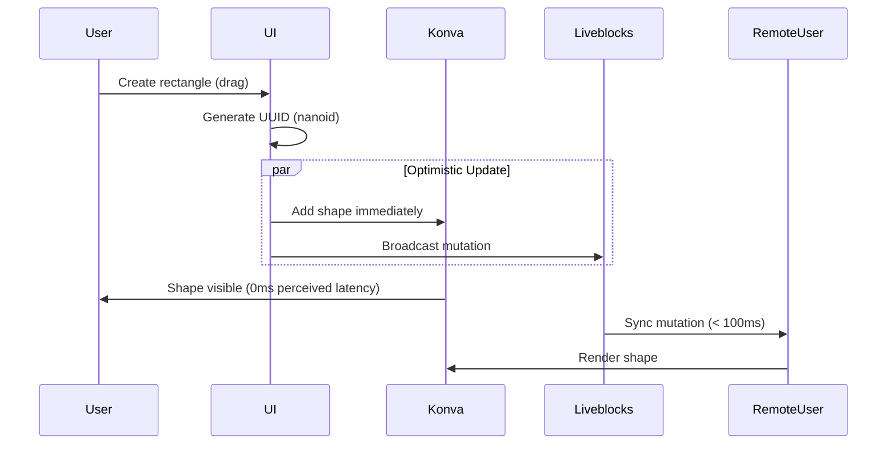
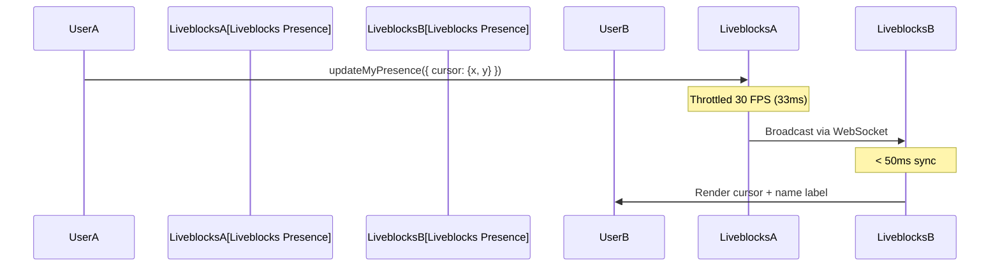
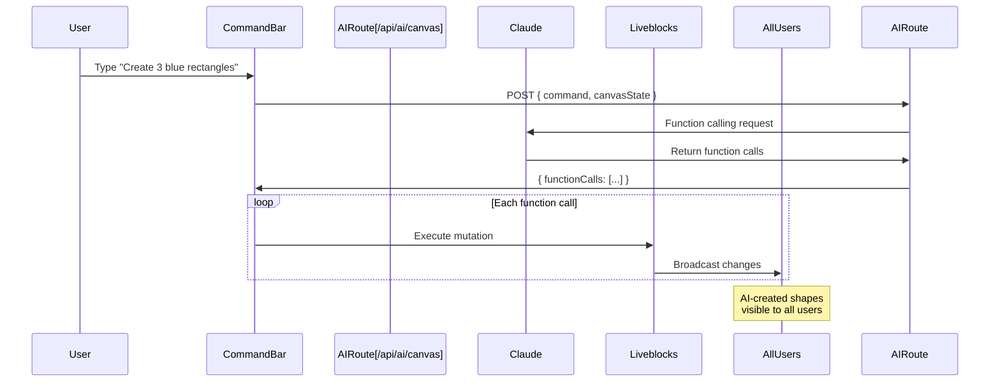

# System Architecture Overview
# CollabCanvas - System Architecture

**Version:** 1.0  
**Date:** October 19, 2025  
**Status:** Approved for Development

---

## Architecture Philosophy

CollabCanvas follows a **modern, serverless, real-time-first architecture** optimized for:
- **Performance:** 60 FPS canvas rendering, < 100ms sync latency
- **Simplicity:** Minimal moving parts, maximum code reuse
- **Scalability:** Serverless infrastructure, horizontal scaling
- **Developer Experience:** Type-safe, well-documented, patterns from proven repos

---

## Key Architectural Decisions

1. **Next.js 15 App Router** - Modern React with RSC (React Server Components)
2. **Liveblocks Lson Storage** - Real-time sync without Y.js complexity
3. **Konva.js for Canvas** - Mature, performant HTML5 canvas library
4. **Claude Haiku 3.5** - Cost-effective AI with excellent function calling
5. **Firebase Anonymous Auth** - Frictionless user identification
6. **Vercel Edge Deployment** - Global CDN, instant deploys

---

## Reference Architecture

**Primary reference:** [andepants/figma-clone](https://github.com/andepants/figma-clone)
- Proven Liveblocks + Konva integration
- Production-tested patterns
- 80% code reuse opportunity
- Saves 3-5 hours development time

---

## High-Level Architecture Diagram

```mermaid
graph TB
    subgraph "Client Browser"
        UI[React UI Components]
        Canvas[Konva Canvas Layer]
        LiveblocksClient[Liveblocks Client SDK]
        FirebaseClient[Firebase Auth SDK]
    end

    subgraph "Next.js App (Vercel)"
        AppRouter[App Router Pages]
        APIRoutes[API Routes]
        AIRoute[/api/ai/canvas]
    end

    subgraph "External Services"
        Liveblocks[Liveblocks Cloud<br/>Real-time Sync]
        Firebase[Firebase Auth<br/>Anonymous Users]
        Claude[Anthropic Claude<br/>Haiku 3.5 API]
    end

    UI --> Canvas
    UI --> LiveblocksClient
    UI --> FirebaseClient
    UI --> APIRoutes

    Canvas --> LiveblocksClient
    LiveblocksClient -->|WebSocket| Liveblocks
    FirebaseClient -->|HTTPS| Firebase
    
    APIRoutes --> AIRoute
    AIRoute -->|Function Calling| Claude
    AIRoute --> LiveblocksClient

    style Canvas fill:#4F46E5,color:#fff
    style Liveblocks fill:#10B981,color:#fff
    style Claude fill:#EC4899,color:#fff
```

---

## Data Flow Architecture

### Object Creation Flow (Optimistic UI)



### Cursor Sync Flow (Presence)



### AI Command Flow



---

## System Components

### Frontend (Client-Side)
- **React 19** - UI components
- **Konva.js** - Canvas rendering (GPU-accelerated)
- **Liveblocks React SDK** - Real-time hooks
- **Firebase SDK** - Authentication
- **Tailwind CSS** - Styling

### Backend (Serverless)
- **Next.js API Routes** - Serverless functions
- **Anthropic Claude API** - AI function calling
- **Liveblocks Storage** - Real-time database
- **Firebase Auth** - User management

### Infrastructure
- **Vercel** - Hosting, CDN, auto-deploy
- **GitHub** - Version control, CI/CD trigger

---

## Performance Architecture

### Target Metrics
- **60 FPS** during all interactions
- **< 100ms** object sync across users
- **< 50ms** cursor sync
- **< 2s** AI command execution
- **500+ objects** supported
- **5+ concurrent users** supported

### Optimization Strategies
- Stage-level transforms (GPU-accelerated pan/zoom)
- Selective Konva updates (no full re-render)
- Throttled updates (30 FPS for objects/cursors)
- Optimistic UI (pre-generated UUIDs)
- Code splitting (Next.js automatic)

---

## Security Architecture

### API Key Protection
- **Server-side only:** Anthropic, Liveblocks secret keys
- **Client-side safe:** Firebase config, Liveblocks public key
- **Environment variables:** All keys in `.env.local`
- **Git ignored:** `.env.local` never committed

### Input Validation
- AI commands: Max 500 chars
- Object counts: Max 10 per AI command
- Canvas bounds: All positions clamped
- Colors: Hex format validation

---

## Scalability Considerations

### Current Scope (MVP)
- **Users:** 5-10 concurrent per room
- **Objects:** 500+ per canvas
- **Rooms:** Unlimited (Liveblocks handles)

### Future Scaling
- **Horizontal:** More Vercel edge functions
- **Storage:** Liveblocks auto-scales
- **CDN:** Global edge network (Vercel)

---

## Technology Choices Summary

| Component | Technology | Why Chosen |
|-----------|-----------|------------|
| Framework | Next.js 15 | Modern, serverless, React 19 |
| Canvas | Konva.js | Mature, performant, event system |
| Real-time | Liveblocks | Purpose-built, proven in figma-clone |
| Auth | Firebase | Frictionless anonymous auth |
| AI | Claude Haiku 3.5 | Cheapest, fast, great function calling |
| Hosting | Vercel | One-click deploy, global CDN |
| Styling | Tailwind CSS | Utility-first, fast development |

---

## Related Documents

- **Component Structure:** See `component-structure.md`
- **Data Architecture:** See `data-architecture.md`
- **Coding Standards:** See `coding-standards.md`
- **Tech Stack:** See `tech-stack.md`
- **ADRs:** See `adr-0001-liveblocks.md` through `adr-0004-firebase-auth.md`

---

## Next Steps

1. Review component structure and data schemas
2. Read ADRs to understand key decisions
3. Follow coding standards during implementation
4. Reference figma-clone patterns when stuck